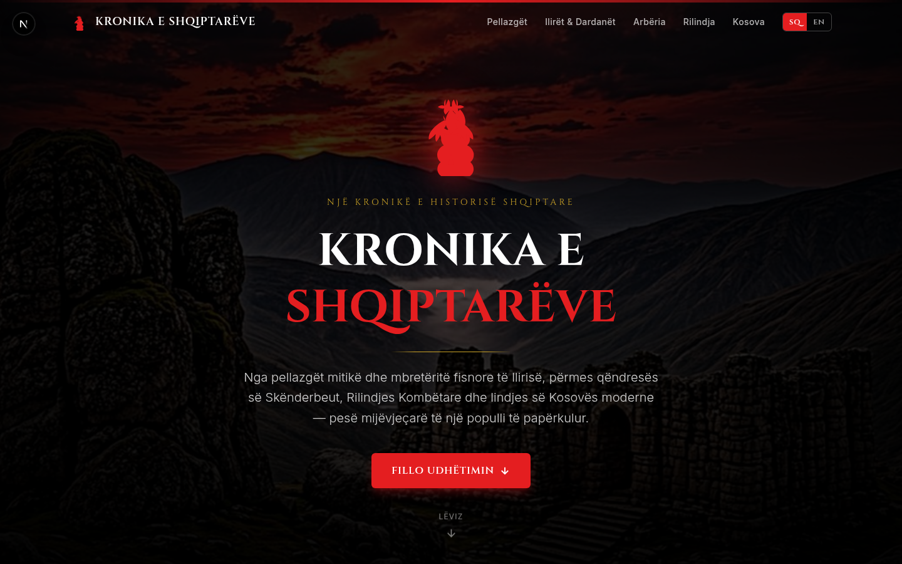
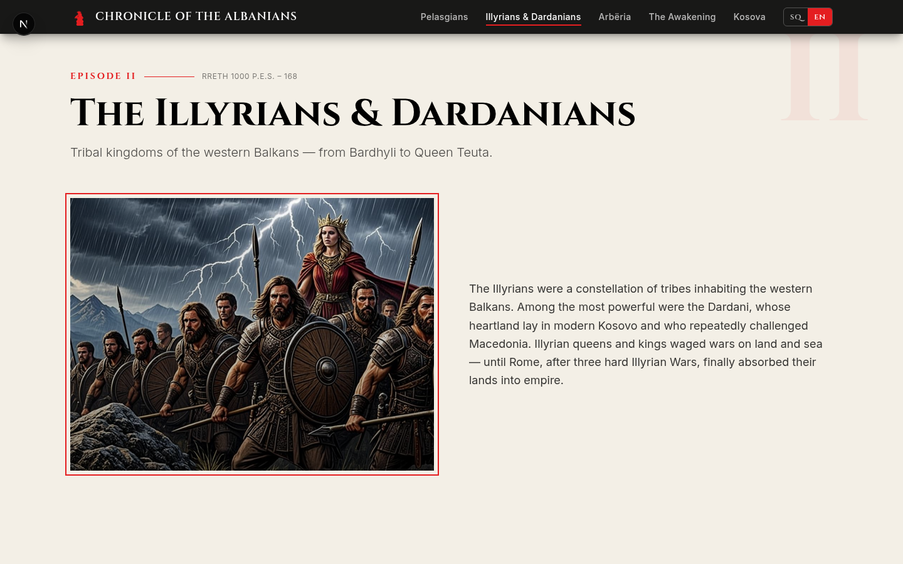

# Kronika e Shqiptarëve · Chronicle of the Albanians

> An interactive, bilingual (Albanian / English) single-page educational website chronicling the entire timeline of Albanian history — from the mythic Pelasgians to modern Kosovo.



---

## Shqip · Përmbledhje

**Kronika e Shqiptarëve** është një faqe web edukative, interaktive dhe plotësisht dygjuhëshe (shqip / anglisht) që rrëfen historinë e popullit shqiptar përmes pesë epokave të mëdha:

1. **Pellazgët** — Themelet para-helenike, muret ciklopike dhe teoria pellazge e gjuhës shqipe.
2. **Ilirët & Dardanët** — Mbretëritë fisnore të Ballkanit, Bardhyli, Mbretëresha Teuta dhe pushtimi romak.
3. **Arbëria** — Mesjeta, Principata e Arbërit, Skënderbeu, Lidhja e Lezhës (1444) dhe qëndresa kundër osmanëve.
4. **Rilindja & Pavarësia** — Lidhja e Prizrenit (1878), vëllezërit Frashëri, Ismail Qemali dhe Shpallja e Pavarësisë (28 Nëntor 1912).
5. **Kosova & Shqipëria Modernë** — UÇK, Adem Jashari, ndërhyrja e NATO-s (1999) dhe Pavarësia e Kosovës (17 Shkurt 2008).

### Veçoritë
- 🌐 **Dygjuhësh** — çdo tekst, titull, figurë dhe ngjarje është në shqip dhe anglisht, me një buton SQ/EN.
- 🦅 **Shqiponja dykrenare** — motiv SVG i stilizuar në hero me animacion glow.
- 🎨 **Paleta e flamurit** — e kuqe e thellë (`#E41E20`), e zezë (`#000000`) dhe pergamenë (`#F9F7F2`).
- ✍️ **Tipografia** — `Cinzel` për titujt (ndjesi monumentale antike), `Inter` për tekstin.
- 🧭 **Navigacion ngjitës** me scroll-spy dhe lëvizje të butë te çdo epokë.
- ✨ **Animacionet fade-in** me `IntersectionObserver` kur seksionet hyjnë në pamje.
- 📜 **Linja e kohës** me ngjarje të datuara për çdo epokë.
- 📱 **Plotësisht responsiv** — qasja mobile-first me menunë hamburger.

---

## English · Overview

**Kronika e Shqiptarëve** is an interactive, fully bilingual (Albanian / English) single-page educational website that tells the story of the Albanian people across five great ages:

1. **Pellazgët / The Pelasgians** — Pre-Hellenic foundations, cyclopean walls, and the Pelasgian theory of the Albanian language.
2. **Ilirët & Dardanët / The Illyrians & Dardanians** — Tribal kingdoms of the western Balkans, Bardhyli, Queen Teuta, and the Roman conquest.
3. **Arbëria / Arbëria** — The Middle Ages, the Principality of Arbër, Skanderbeg, the League of Lezha (1444), and resistance against the Ottomans.
4. **Rilindja & Pavarësia / The Awakening & Independence** — The League of Prizren (1878), the Frashëri brothers, Ismail Qemali, and the Declaration of Independence (28 November 1912).
5. **Kosova & Shqipëria Modernë / Kosova & Modern Albania** — The UÇK, Adem Jashari, the NATO intervention (1999), and Kosovo's independence (17 February 2008).



### Features
- 🌐 **Bilingual** — every string, heading, figure, and event exists in both Albanian and English, toggled live via an SQ/EN switch.
- 🦅 **Double-headed eagle** — stylized SVG motif in the hero with a glowing pulse animation.
- 🎨 **Flag palette** — deep crimson (`#E41E20`), stark black (`#000000`), and parchment off-white (`#F9F7F2`).
- ✍️ **Typography** — `Cinzel` for headers (a monumental, ancient feel), `Inter` for body text.
- 🧭 **Sticky navigation** with scroll-spy highlighting and smooth scrolling to each era.
- ✨ **Fade-in animations** via `IntersectionObserver` as sections enter the viewport.
- 📜 **Timeline** of dated events for each era.
- 📱 **Fully responsive** — mobile-first with a hamburger menu.

---

## Tech Stack

| Layer | Technology |
| --- | --- |
| Framework | Next.js 16 (App Router) |
| Language | TypeScript 5 |
| Styling | Tailwind CSS 4 |
| Fonts | Google Fonts — `Cinzel` & `Inter` |
| Images | AI-generated historical illustrations |
| Animations | CSS + `IntersectionObserver` |

---

## Getting Started

```bash
# Install dependencies
bun install

# Start the dev server (http://localhost:3000)
bun run dev

# Lint
bun run lint
```

> The site is a single route (`/`) defined in `src/app/page.tsx`.

---

## Project Structure

```
.
├── docs/
│   ├── hero.png              # Hero screenshot (Albanian)
│   └── era-screenshot.png    # Era section screenshot (English)
├── public/
│   └── images/               # AI-generated historical illustrations
│       ├── hero.jpg
│       ├── pelasgians.jpg
│       ├── illyrians.jpg
│       ├── arberia.jpg
│       ├── rilindja.jpg
│       └── kosova.jpg
├── src/
│   ├── app/
│   │   ├── globals.css       # Albanian flag palette + custom utilities
│   │   ├── layout.tsx        # Cinzel + Inter fonts, metadata
│   │   └── page.tsx          # The full bilingual chronicle
│   └── components/ui/        # shadcn/ui component library
└── README.md
```

---

## Historical Sources & Notes

This project is an educational chronicle built for cultural appreciation. The narrative draws on widely-known figures and events of Albanian historiography, including:

- The **Pelasgian theory** advanced by Johann Georg von Hahn (1854).
- The **Illyrian Wars** and the reigns of Bardhyli, Teuta, and Gentius.
- **Marin Barleti's** *Historia de vita et gestis Scanderbegi* (1508–1510).
- The **League of Prizren** (1878) and the **Manastir Congress** (1908).
- The **Declaration of Independence** of Albania (28 November 1912).
- The **Kosovo War** (1998–1999), NATO intervention, and Kosovo's independence (2008).

> Images are AI-generated illustrations intended to evoke the atmosphere of each era; they are not archival photographs.

---

## Acknowledgements

Built with reverence for the past.

> *"Feja e shqiptarit është shqiptaria."* — Pashko Vasa, 1881

---

## License

This project is released for educational and cultural use.
